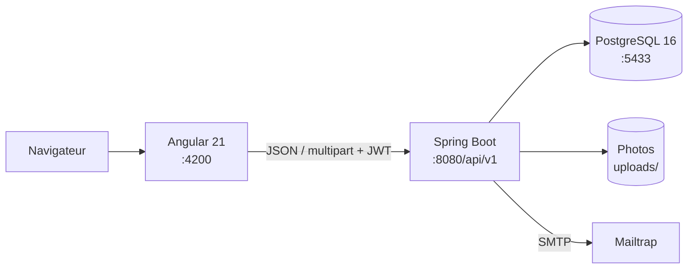

# 🏙️ SignalVille

**Plateforme web de signalement et de suivi des incidents urbains : du citoyen à l'agent de terrain.**


## 📌 À propos

SignalVille permet à un citoyen de signaler un incident (voirie, éclairage public, déchets, eau et assainissement) avec sa position et des photos, puis de suivre son traitement. Les services municipaux disposent d'espaces dédiés pour affecter, traiter, clôturer et piloter. Le projet est composé d'une API REST Spring Boot et d'une application Angular.

## ✨ Fonctionnalités

- 👥 **4 rôles** : citoyen, agent, superviseur, administrateur.
- 🔐 Authentification JWT (accès 15 min + refresh token 7 jours avec rotation), changement de mot de passe, mot de passe temporaire pour les comptes internes.
- 📝 Création de signalements géolocalisés avec 1 à 3 photos (JPEG/PNG, 5 Mo max) et référence `SV-AAAA-NNNNNN`.
- 🔄 Cycle de vie : `NOUVEAU → AFFECTE → EN_COURS → RESOLU → CLOTURE`, avec rejet, annulation, réaffectation et réouverture ; historique complet.
- 🛠️ Résolution par l'agent avec preuves photo ; notes internes ou publiques.
- 🔔 Notifications internes.
- 🗺️ Carte superviseur (Leaflet / OpenStreetMap) avec marqueurs colorés et filtres.
- 📊 Tableaux de bord par rôle et statistiques (générales, par agent, série temporelle).
- ⚙️ Administration des catégories et des utilisateurs, envoi optionnel des identifiants par e-mail.

## 🛠️ Technologies

| Couche | Technologies |
|---|---|
| Backend | Java 21, Spring Boot 4.1.0 (Web MVC, Data JPA, Security, Validation, Mail, Actuator), jjwt, Lombok |
| Base de données | PostgreSQL 16, Flyway |
| Frontend | Angular 21, TypeScript 5.9, RxJS, Leaflet |
| API | OpenAPI 3.1, springdoc / Swagger UI |
| Outils | Maven (wrapper), Docker Compose, Testcontainers, Vitest, Mailtrap (e-mails de dev) |

## 🏗️ Architecture



Le backend est organisé en couches : `api` (contrôleurs, DTO) → `application` (services, mappers) → `domain` (entités) → `infrastructure` (configuration, persistance, sécurité, stockage).

## 📁 Structure du projet

```text
.
├── docs/                      Rapports, contrat OpenAPI
│   └── api/signalville-openapi.yaml
├── signalville-backend/       API Spring Boot
│   ├── docker-compose.yml     PostgreSQL 16
│   ├── .env.example
│   └── src/main/
│       ├── java/africa/epf/signalville_backend/{api,application,domain,infrastructure}
│       └── resources/{application.yml, db/migration/V1…V8}
└── signalville-frontend/      SPA Angular
    └── src/app/{core,features,shared}
```

## ⚙️ Installation

Prérequis : JDK 21, Node.js avec npm 10, Docker.

```bash
git clone <url-du-depot>
cd Projet_Java_Angular

# Backend : configuration et base de données
cd signalville-backend
cp .env.example .env        # puis adapter les valeurs
docker compose up -d

# Frontend
cd ../signalville-frontend
npm install
```

## 🔐 Variables d'environnement

Définies dans `signalville-backend/.env` (modèle : `.env.example`, fichier réel ignoré par Git). Ne jamais versionner de valeurs réelles.

| Variable | Rôle |
|---|---|
| `POSTGRES_DB`, `POSTGRES_USER`, `POSTGRES_PASSWORD`, `POSTGRES_PORT` | Base PostgreSQL |
| `SIGNALVILLE_DB_URL` | URL JDBC |
| `SERVER_PORT` | Port de l'API |
| `SIGNALVILLE_JWT_SECRET` | Secret de signature JWT (≥ 32 octets, en Base64) |
| `SIGNALVILLE_UPLOAD_DIR` | Dossier des photos |
| `SIGNALVILLE_CORS_ALLOWED_ORIGINS` | Origines CORS autorisées |
| `SIGNALVILLE_LOG_LEVEL` | Niveau de log |
| `MAIL_HOST`, `MAIL_PORT`, `MAIL_USERNAME`, `MAIL_PASSWORD` | SMTP (Mailtrap en dev) |
| `MAIL_FROM`, `MAIL_FROM_NAME`, `MAIL_LOGIN_URL` | Paramètres des e-mails |

## ▶️ Lancement

```bash
# Terminal 1 — API (http://localhost:8080/api/v1)
cd signalville-backend
./mvnw spring-boot:run
```

```bash
# Terminal 2 — Interface (http://localhost:4200)
cd signalville-frontend
npm start
```

Swagger UI : `http://localhost:8080/api/v1/swagger-ui.html`

Trois comptes internes de démonstration sont insérés par la migration V5 (`admin@signalville.local`, `fatou.sy@signalville.local`, `moussa.diop@signalville.local`) ; leur mot de passe est indiqué dans `V5__seed_internal_users.sql`. **À supprimer avant tout déploiement réel.**

## 🐳 Docker

Docker n'est utilisé que pour la base de données (`signalville-backend/docker-compose.yml`, image `postgres:16-alpine`, volume persistant `signalville_pgdata`, port 5433 par défaut). Il n'y a pas de Dockerfile pour l'API ni pour le frontend.

## 🔌 API

Préfixe `/api/v1`, 47 endpoints. Principaux groupes :

| Groupe | Exemples |
|---|---|
| Authentification | `POST /auth/register`, `/auth/login`, `/auth/refresh`, `/auth/logout`, `PATCH /auth/password` |
| Signalements | `POST/GET /reports`, `GET /reports/{id}`, `POST /reports/{id}/assign`, `/start`, `/resolve`, `/close`, `/reopen` |
| Administration | `/users`, `/categories` |
| Pilotage | `/dashboard/{citizen,agent,supervisor,admin}`, `/statistics/{general,agents,timeline}` |
| Autres | `/notifications`, `/reports/{id}/notes`, `/photos/{id}`, `/agents/available` |

Contrat complet : [`docs/api/signalville-openapi.yaml`](docs/api/signalville-openapi.yaml).

## 🗄️ Base de données

Onze tables créées par migrations Flyway : `users`, `refresh_tokens`, `categories`, `reports`, `report_photos`, `report_status_history`, `report_reference_counters`, `interventions`, `intervention_proofs`, `report_notes`, `notifications`. Un index unique partiel garantit une seule intervention active par signalement. Le schéma complet et le diagramme ER sont dans le [rapport technique](docs/RAPPORT_TECHNIQUE.md#6-conception-de-la-base-de-données).

## 🧪 Tests

```bash
# Backend (le test de contexte nécessite la base lancée ; les tests *IT utilisent Testcontainers)
cd signalville-backend
./mvnw test

# Frontend
cd signalville-frontend
npm test
```

> ⚠️ État constaté le 3 octobre 2026 : le build frontend (`npx ng build`) et la compilation backend réussissent, mais les suites de tests ne passent pas en l'état (voir la section 14 du [rapport technique](docs/RAPPORT_TECHNIQUE.md#14-tests-et-validation)).


## 🚀 Améliorations futures

*Pistes envisagées, non développées à ce jour :*

- tests unitaires des services et correction de la suite existante ;
- contrôle de rôle dans le routage Angular ;
- réinitialisation de mot de passe par e-mail ;
- Dockerfiles, déploiement complet et intégration continue ;
- notifications en temps réel et stockage objet des photos.

## 👤 Auteur

Kenneth Dossou

## 📄 Documentation

- [Rapport technique](docs/RAPPORT_TECHNIQUE.md)
- [Contrat OpenAPI](docs/api/signalville-openapi.yaml)
- [Guide de `SecurityConfig`](docs/Explained_security_config.md)
